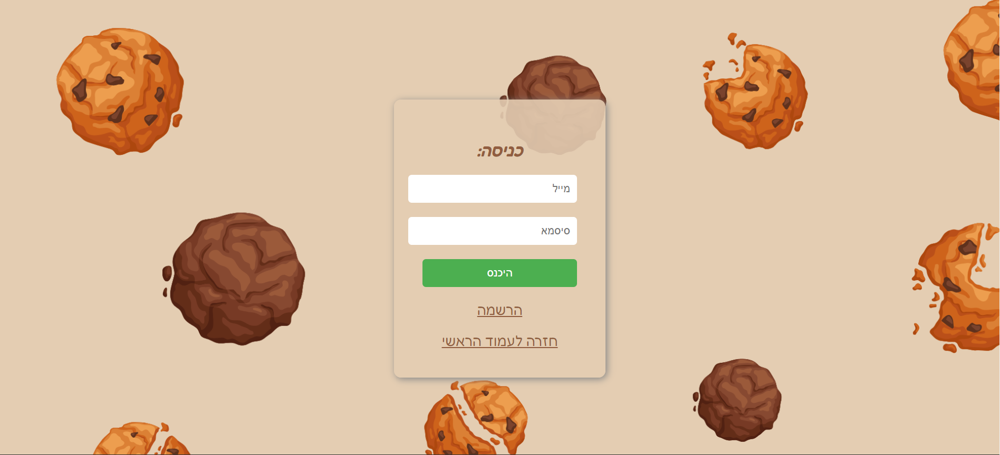
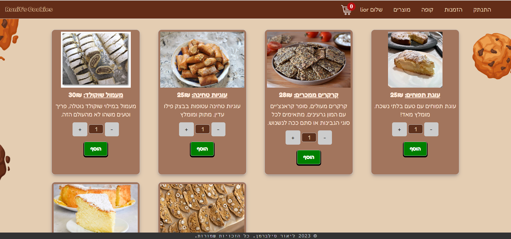
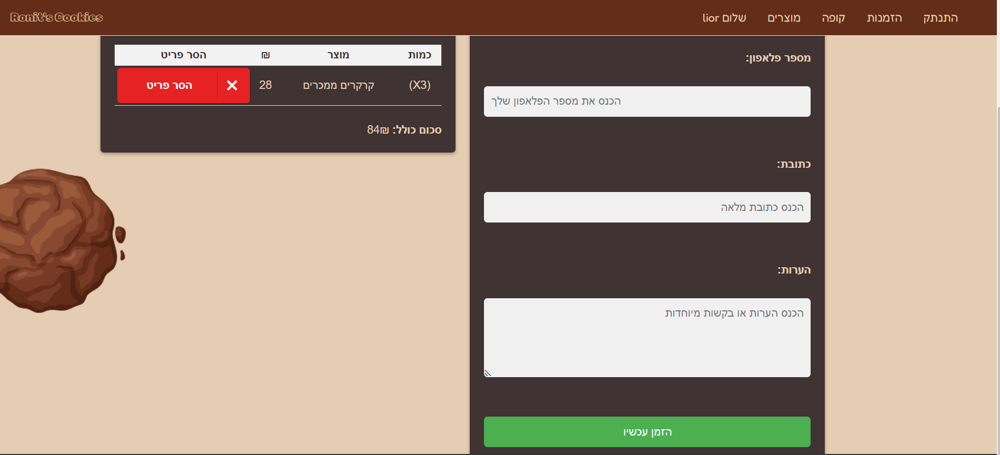
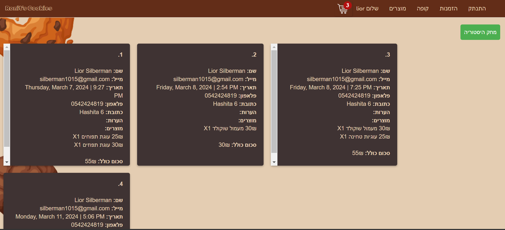

# Ronit's Cookies

Welcome to Ronit's Cookies, a delightful web application for ordering delicious homemade cookies online. This project is developed using Node.js, MongoDB, and JavaScript.

## Table of Contents

- [About](#about)
- [Features](#features)
- [Technologies Used](#technologies-used)
- [Installation](#installation)
- [Contributing](#contributing)
- [Screenshot](#screenshots)

## About

Ronit's Cookies is an online platform that allows users to browse, select, and order a variety of homemade cookies. This application aims to provide a seamless and user-friendly experience for cookie lovers to satisfy their cravings with ease.

## Features

- **User Authentication**: Secure user registration and login system.
- **Product Catalog**: Browse a wide selection of cookies with descriptions and prices.
- **Order Management**: Add cookies to the cart and place orders efficiently.
- **Email Confirmation**: Receive an email confirmation after placing an order.
- **Responsive Design**: User-friendly interface accessible on both desktop and mobile devices.

## Technologies Used

- **Frontend**: HTML, CSS, JavaScript
- **Backend**: Node.js, Express.js
- **Database**: MongoDB
- **Email Service**: Nodemailer

## Installation

Follow these steps to set up the project locally:

1. Clone the repository: 
   `git clone https://github.com/LiorSilberman/Ronit-s-Cookies.git` 
   `cd Ronit-s-Cookies` 

2. Install the dependencies: 
    `npm install`

3. Set up environment variables:
    Create a .env file in the root directory. 
    Add your MongoDB connection string and email service credentials to the `.env` file: 
        `MONGODB_URI=your-mongodb-uri` 
        `EMAIL_SERVICE=your-email-service` 
        `EMAIL_USER=your-email-username` 
        `EMAIL_PASS=your-email-password` 

4. Start the server: 
    `npm start`

5. Open your browser and navigate to http://localhost:3000 to view the application.

## Contributing
**We welcome contributions to improve Ronit's Cookies! To contribute:**
1. Fork the repository:
    
    `git clone https://github.com/LiorSilberman/Ronit-s-Cookies.git`
    `cd Ronit-s-Cookies`
    `git checkout -b feature-branch`

2. Create a new branch (`git checkout -b feature-branch`).

3. Make your changes and commit them (`git commit -m 'Add some feature'`).

4. Push to the branch (`git push origin feature-branch`).

5. Open a pull request.

## Screenshots
- **Main page:**

- **Login page:**

- **Products page:**

- **Checkout page:**

- **previous orders page:**
