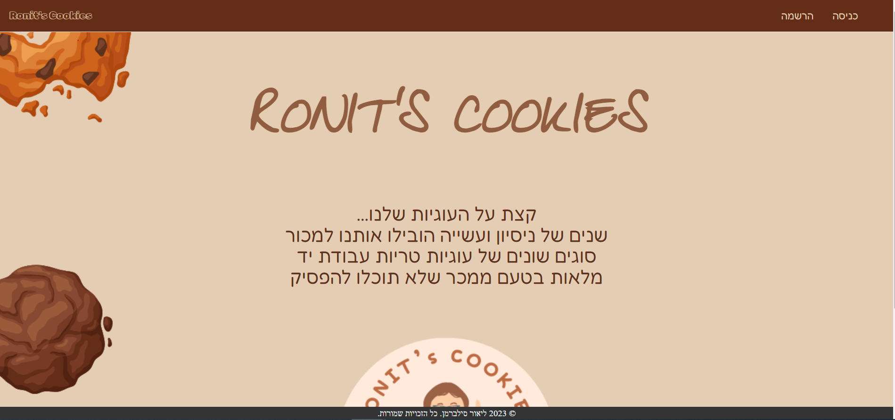

# Ronit's Cookies

Welcome to Ronit's Cookies, a delightful web application for ordering delicious homemade cookies online. This project is developed using Node.js, MongoDB, and JavaScript.

## Table of Contents

- [About](#about)
- [Features](#features)
- [Technologies Used](#technologies-used)
- [Screenshot](#screenshots)

## About

Ronit's Cookies is an online platform that allows users to browse, select, and order a variety of homemade cookies. This application aims to provide a seamless and user-friendly experience for cookie lovers to satisfy their cravings with ease.

## Features

- **User Authentication**: Secure user registration and login system.
- **Product Catalog**: Browse a wide selection of cookies with descriptions and prices.
- **Order Management**: Add cookies to the cart and place orders efficiently.
- **Email Confirmation**: Receive an email confirmation after placing an order.
- **Responsive Design**: User-friendly interface accessible on both desktop and mobile devices.

## Technologies Used

- **Frontend**: HTML, CSS, JavaScript
- **Backend**: Node.js, Express.js
- **Database**: MongoDB
- **Email Service**: Nodemailer

## Screenshots
**Main page:**

**Login page:**

**Products page:**

**Checkout page:**

**previous orders page:**
